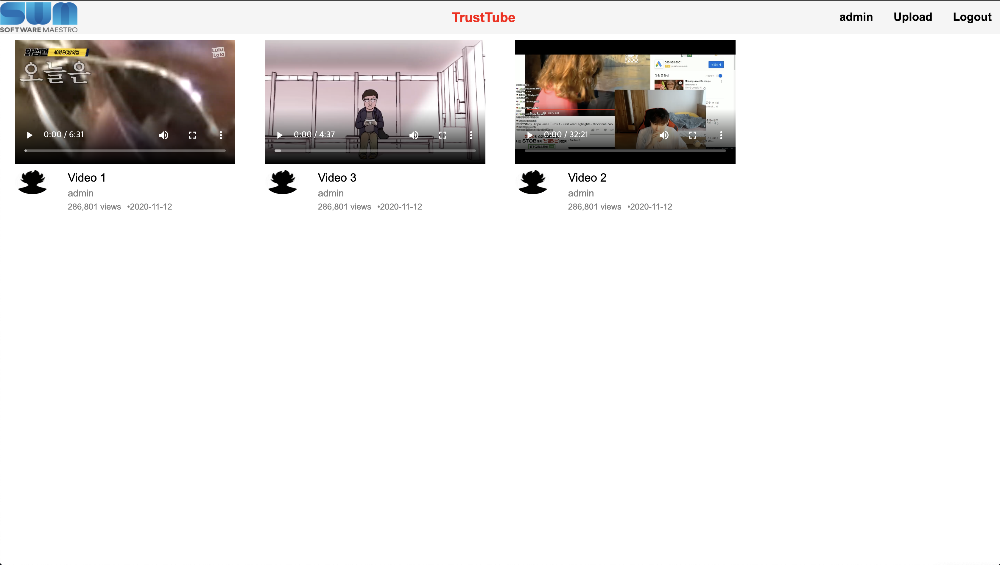
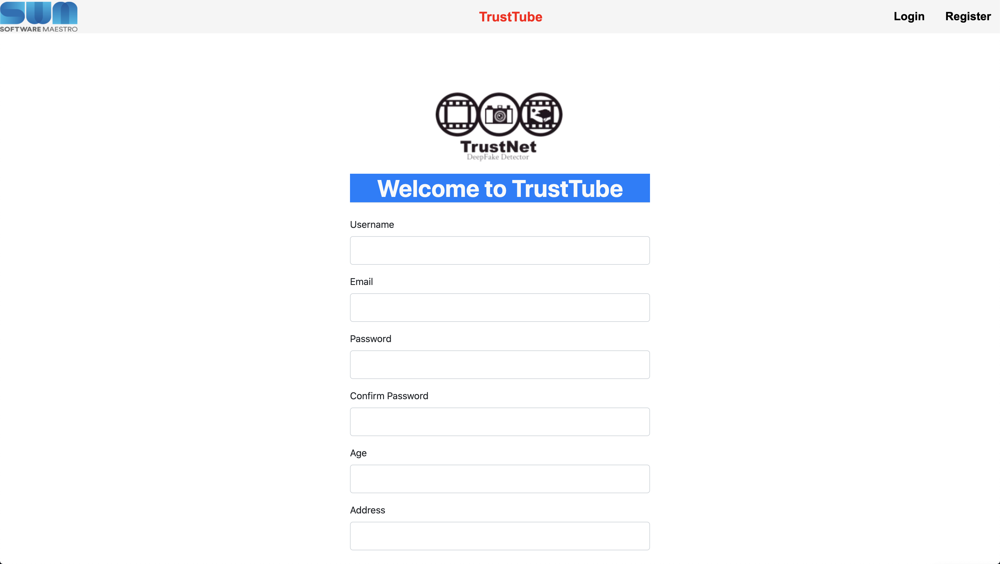
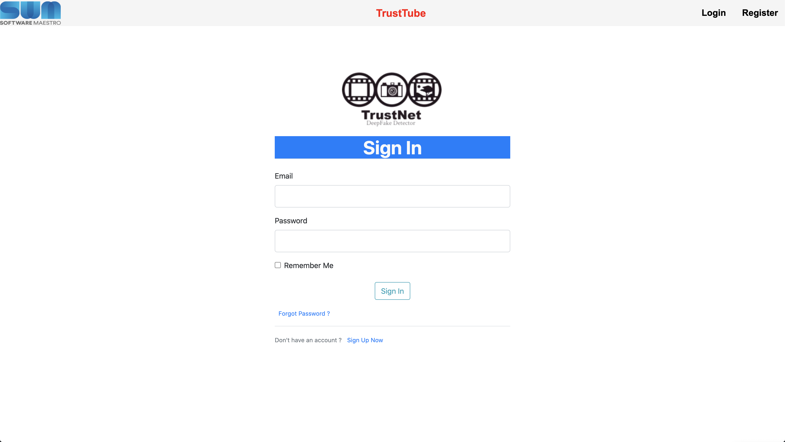
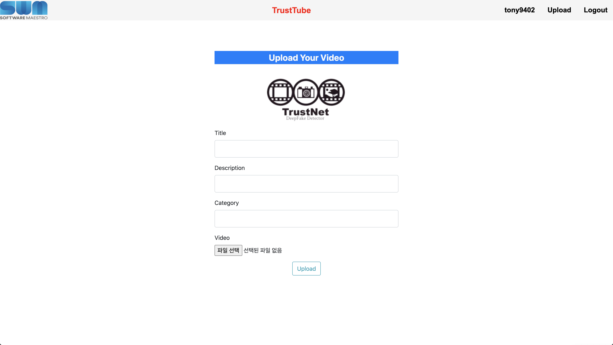
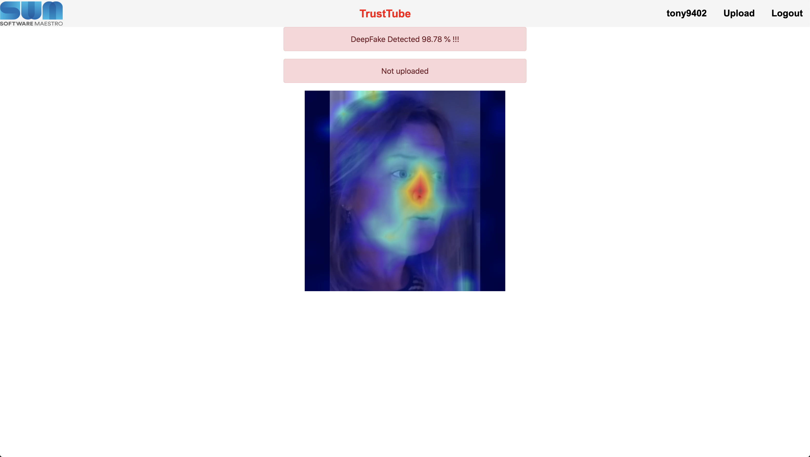

# DeepFake-Website-SWM-project

[](https://git.swmgit.org/swmaestro/trustnet-2)
[](https://github.com/pytorch/pytorch/releases/tag/v1.7.0)
[](https://github.com/NVIDIA/TensorRT/releases/tag/20.10)
[](https://github.com/opencv/opencv/releases/tag/4.4.0)
[](https://github.com/pallets/flask/releases/tag/1.1.2)
[](https://github.com/triton-inference-server/server)

Software Maestro 11th Project

## How to run

### Building docker image & Running docker

```bash
docker build -t trustnetapi .
docker run --name trustnetapi --gpus all -it -d --net=host --ipc=host -v <your workspace>:/to/path/dir/ trustnetapi
```

### Instructions Python packages

```bash
pip3 install -r requirements.txt
```

### Run

```bash
./run
```


## TrustTube Preview

### TrustTube Main Page



### TrustTube Register Page



### TrustTube Login Page



### TrustTube Upload Page




### DeepFake Detected page with (Class Activation Map)




## Directory Structure :

    .
    ├── [2.9K]  Dockerfile
    ├── [1.0K]  LICENSE
    ├── [3.5K]  README.md
    ├── [ 256]  api
    │   ├── [7.5K]  TrustNetAPI.py
    │   ├── [6.7K]  classifiers.py
    │   ├── [ 18K]  deepfake_utils.py
    │   ├── [7.3K]  grad_cam.py
    │   └── [  96]  weights
    ├── [ 288]  app
    │   ├── [ 465]  __init__.py
    │   ├── [3.9K]  forms.py
    │   ├── [3.5K]  models.py
    │   ├── [7.7K]  routes.py
    │   ├── [ 224]  static
    │   │   ├── [ 128]  avatar
    │   │   │   ├── [ 14K]  avatar.png
    │   │   │   └── [ 31K]  student.png
    │   │   ├── [  96]  cover_pics
    │   │   │   └── [3.6K]  cover.png
    │   │   ├── [ 160]  css
    │   │   │   ├── [1.3K]  kopubdotum.css
    │   │   │   ├── [7.3K]  main.css
    │   │   │   └── [ 12K]  style.css
    │   │   ├── [ 128]  logo
    │   │   │   ├── [ 79K]  sw_maestro.png
    │   │   │   └── [ 36K]  trustNet.png
    │   │   └── [  96]  videos
    │   └── [ 352]  templates
    │       ├── [1.2K]  CAM.html
    │       ├── [3.2K]  account.html
    │       ├── [1.9K]  home.html
    │       ├── [2.5K]  layout.html
    │       ├── [2.5K]  login.html
    │       ├── [4.7K]  register.html
    │       ├── [2.6K]  update_video.html
    │       ├── [5.2K]  upload.html
    │       └── [4.7K]  video.html
    ├── [ 351]  config.py
    ├── [ 256]  images
    │   ├── [1.2M]  Homepage.png
    │   ├── [ 27K]  Homepage1.png
    │   ├── [682K]  Homepage2.png
    │   ├── [338K]  Homepage3.png
    │   ├── [332K]  Homepage4.png
    │   └── [342K]  Homepage5.png
    ├── [ 224]  migrations
    │   ├── [ 770]  alembic.ini
    │   ├── [2.8K]  env.py
    │   ├── [ 494]  script.py.mako
    │   └── [  96]  versions
    │       └── [2.9K]  b0e1bb55d78d_create_models.py
    ├── [ 524]  requirements.txt
    ├── [ 131]  reset
    ├── [  18]  run
    ├── [ 984]  server.py
    ├── [  60]  youtube.code-workspace
    └── [ 52K]  youtube.db
